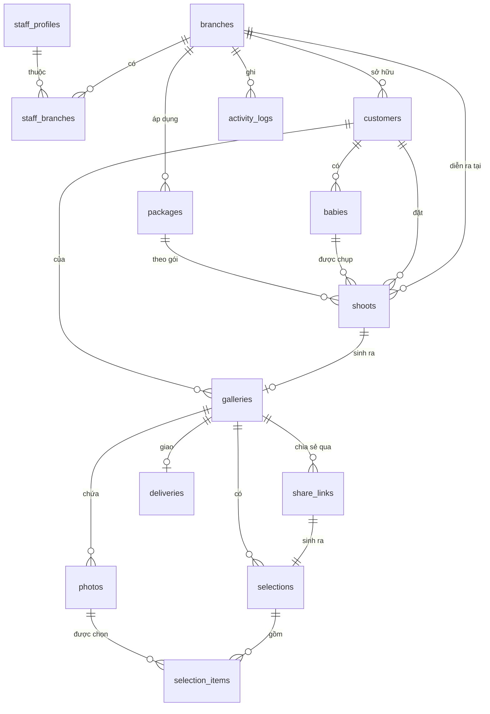

# 03 — Mô hình dữ liệu

Nguồn sự thật: [`db/schema.sql`](../db/schema.sql). Tài liệu này giải thích ý đồ.

## 1. Sơ đồ quan hệ



## 2. Ý đồ từng nhóm bảng

### 2.1 Nhóm tổ chức — `branches`, `staff_profiles`, `staff_branches`

`staff_profiles.id` trùng `auth.users.id` của Supabase: một người = một tài khoản đăng nhập = một hồ sơ.

Quan hệ nhân sự ↔ chi nhánh là **nhiều-nhiều** dù hiện tại đa số chỉ thuộc một chi nhánh. Lý do: quản lý vùng và retoucher tập trung phục vụ cả 3 chi nhánh; nếu để `branch_id` đơn thì Phase 3 phải migrate.

### 2.2 Nhóm khách hàng — `customers`, `babies`

- `customers` thuộc về một chi nhánh (chi nhánh tạo hồ sơ), nhưng khách có thể chụp ở chi nhánh khác — buổi chụp mới là thứ mang `branch_id` thực tế.
- `phone_normalized` là cột generated, bỏ hết ký tự không phải số, dùng cho unique index chống trùng và cho tìm kiếm.
- Tách `babies` khỏi `customers` vì một gia đình có nhiều bé, và `birth_date` là chìa khoá cho chiến dịch nhắc sinh nhật ở Phase 3.

### 2.3 Nhóm album — `galleries`, `photos`

**`galleries` là trung tâm của hệ thống.** Nó gộp ba thứ:
1. Con trỏ tới thư mục Drive (`drive_folder_id`, `drive_folder_url`).
2. Luật chơi khi khách chọn (`included_quota`, `extra_photo_price`, `max_selection`, `due_at`).
3. Trạng thái vòng đời (`status` + các mốc thời gian).

Quota được **chép** từ `packages` sang `galleries` lúc tạo album, không tham chiếu động. Lý do: đổi giá gói năm sau không được làm thay đổi album đã gửi khách.

**`photos`** chỉ là bản cache metadata. `drive_file_id` là khoá tự nhiên, unique theo `(gallery_id, drive_file_id)` để đồng bộ lại là thao tác upsert idempotent.

- `sort_index` quyết định thứ tự hiển thị — tính bằng natural sort tên file lúc đồng bộ, để `IMG_9.jpg` đứng trước `IMG_10.jpg`.
- `subfolder` giữ tên thư mục con của Drive → hiển thị thành nhóm concept trên UI.
- `status = 'missing'` khi file biến mất khỏi Drive: **không xoá dòng**, vì có thể khách đã chọn ảnh đó.

### 2.4 Nhóm chia sẻ & chọn — `share_links`, `selections`, `selection_items`

Mô hình 1 link = 1 phiên chọn:

```
gallery
 ├── share_link (role=owner,     label="Mẹ bé")      → selection (is_primary = true)
 ├── share_link (role=suggester, label="Bà ngoại")   → selection
 └── share_link (role=viewer,    label="Xem chung")  → selection (rỗng)
```

- **Chỉ `selection.is_primary` được tính vào quota và kết quả chốt.** Các phiên khác chỉ để tham khảo/đề xuất.
- `token_hash` = SHA-256 của token; token gốc **không bao giờ lưu**. Mất link thì thu hồi và cấp link mới, không "xem lại link cũ".
- `token_prefix` (6 ký tự) chỉ để hiển thị trong danh sách và log, không đủ để đăng nhập.
- `pin_hash` dùng bcrypt. `failed_attempts` + `locked_until` chống dò PIN.

`selection_items` có `gallery_id` **phi chuẩn hoá** — cố ý. Nó cho phép RLS và các truy vấn báo cáo lọc theo album mà không cần join qua `selections`.

`selection_ops` giữ `client_op_id` để ghi theo lô là idempotent: client retry vô hại.

### 2.5 Nhóm mở rộng — `shoots`, `deliveries`, `notifications`, `settings`

Phase 1 có thể để `shoots` gần như trống (chỉ dùng khi tạo album), nhưng bảng đã có sẵn để Phase 3 gắn module booking mà không phải phá cấu trúc.

`settings` là JSONB theo `(key, branch_id)`, `branch_id = null` nghĩa là cấu hình toàn hệ thống. Thêm cấu hình mới không cần migration.

## 3. Vòng đời album

```
   ┌────────┐  tạo    ┌─────────┐ đọc Drive  ┌────────────┐
   │ draft  ├────────►│ syncing ├───────────►│   ready    │
   └────────┘         └────┬────┘            └─────┬──────┘
                           │ lỗi                   │ gửi link + khách mở
                           ▼                       ▼
                    ┌────────────┐          ┌────────────┐
                    │ sync_error │          │ in_review  │
                    └────────────┘          └─────┬──────┘
                                                  │ khách bấm chốt
                       quá hạn ◄──────────────────┤
                          │                       ▼
                    ┌─────┴──────┐         ┌────────────┐
                    │  expired   │         │ submitted  │
                    └─────┬──────┘         └─────┬──────┘
                          │ nhân viên gia hạn    │ chuyển retouch
                          ▼                      ▼
                     in_review            ┌────────────┐
                                          │ in_retouch │
                                          └─────┬──────┘
                                                ▼
                                          ┌────────────┐    ┌──────────┐
                                          │ delivered  ├───►│ archived │
                                          └────────────┘    └──────────┘
```

**Quy tắc chuyển trạng thái**

| Từ | Sang | Ai được làm | Điều kiện |
|---|---|---|---|
| `draft` | `syncing` | cs, manager, admin | có `drive_folder_id` hợp lệ |
| `syncing` | `ready` | hệ thống | đồng bộ xong, `photo_count > 0` |
| `syncing` | `sync_error` | hệ thống | Drive trả lỗi |
| `ready` | `in_review` | hệ thống | lần đầu khách mở link |
| `ready`/`in_review` | `submitted` | **chỉ khách** (share_link role=owner) | có ≥ 1 ảnh chọn |
| `ready`/`in_review` | `expired` | hệ thống (cron) | `due_at < now()` |
| `expired` | `in_review` | cs, manager, admin | gia hạn `due_at` |
| `submitted` | `in_review` | manager, admin | **bắt buộc ghi `reopen_reason`**, có log |
| `submitted` | `in_retouch` | cs, manager, retoucher | — |
| `in_retouch` | `delivered` | cs, manager, retoucher | — |
| bất kỳ | `archived` | manager, admin | — |

## 4. Bất biến (invariants) — bắt buộc kiểm trong test

1. Một `gallery` có **tối đa một** `selection` với `is_primary = true` (đảm bảo bởi unique index).
2. Một `(selection_id, photo_id)` chỉ có một dòng `selection_items`.
3. `selection_items.gallery_id` luôn bằng `selections.gallery_id` tương ứng — kiểm ở tầng service khi ghi.
4. Sau khi `gallery.status = 'submitted'`, không có `selection_items` nào của phiên primary thay đổi, trừ khi có `reopened_at` mới hơn `submitted_at`.
5. `snapshot_selected_count` được ghi tại thời điểm submit và **không bao giờ tính lại**.
6. `max_selection >= included_quota` (đảm bảo bởi CHECK constraint).
7. Không có `photos` nào bị xoá cứng khi file mất trên Drive — chỉ đổi `status = 'missing'`.

## 5. Chiến lược index

| Truy vấn | Index |
|---|---|
| Lưới ảnh của một album | `idx_photos_gallery_sort (gallery_id, sort_index) WHERE status='active'` |
| Dashboard theo chi nhánh | `idx_galleries_branch_status (branch_id, status)` |
| Album sắp hết hạn | `idx_galleries_due (due_at) WHERE status IN ('ready','in_review')` |
| Tìm khách theo tên | `idx_customers_name_trgm` GIN trigram |
| Chống trùng SĐT | `uq_customers_phone_branch` |
| Tra link chia sẻ | `share_links.token_hash` UNIQUE |
| Kết quả chọn của album | `idx_selection_items_gallery` |
| Nhật ký theo chi nhánh | `idx_activity_branch_time (branch_id, created_at DESC)` |

## 6. Ước lượng khối lượng

| Bảng | Sau 1 năm (3 chi nhánh) |
|---|---|
| `galleries` | ~3.600 (10 album/ngày) |
| `photos` | ~2,7 triệu (750 ảnh/album) |
| `selection_items` | ~90.000 |
| `activity_logs` | ~500.000 |

`photos` là bảng lớn nhất. Kế hoạch: sau 2 năm, chuyển album `archived` sang bảng lưu trữ hoặc partition theo năm. Chưa cần ở Phase 1.
